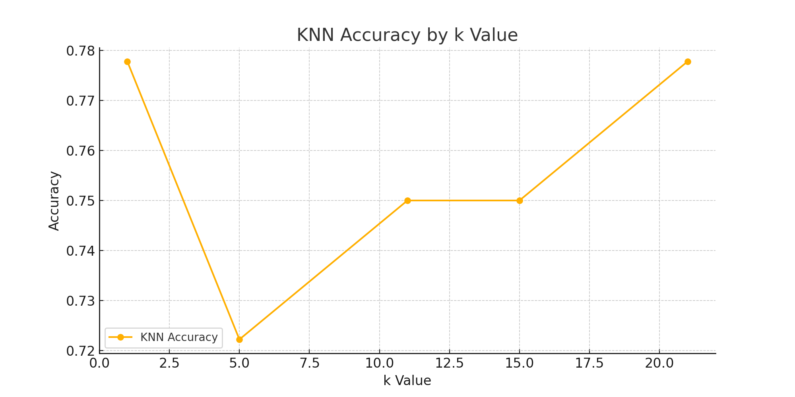

# Lab 2: Classification Using KNN and RNN Algorithms

## Purpose
This lab investigates the performance of K-Nearest Neighbors (KNN) and Radius Neighbors (RNN) classifiers on the Wine dataset using scikit-learn.

## Key Insights
- KNN performed best at k=1 and k=21 with an accuracy of 77.78%.
- RNN performance was relatively low with a flat accuracy trend and some missing predictions due to lack of neighbors in certain radius settings.

## Challenges
- RNN struggled with high radius values due to the sparsity of neighbors in test data.
- The RNN classifier requires careful parameter tuning and may mislabel samples as outliers.

## Results Visualization

